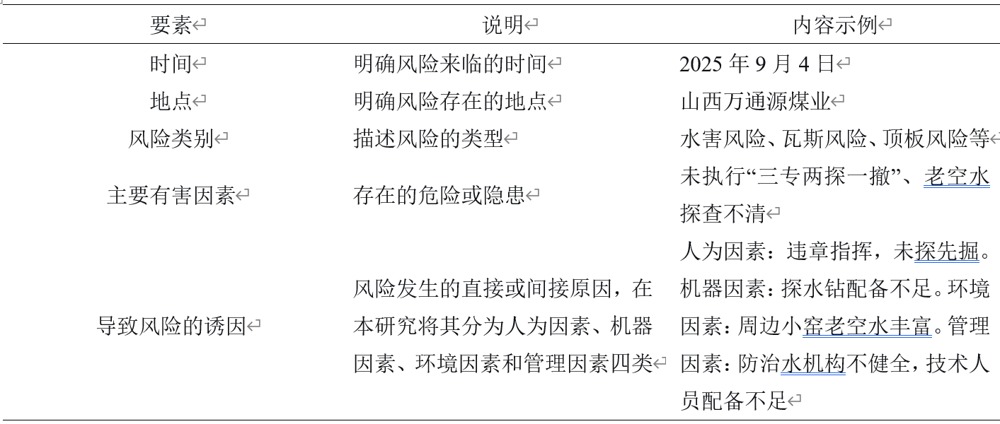
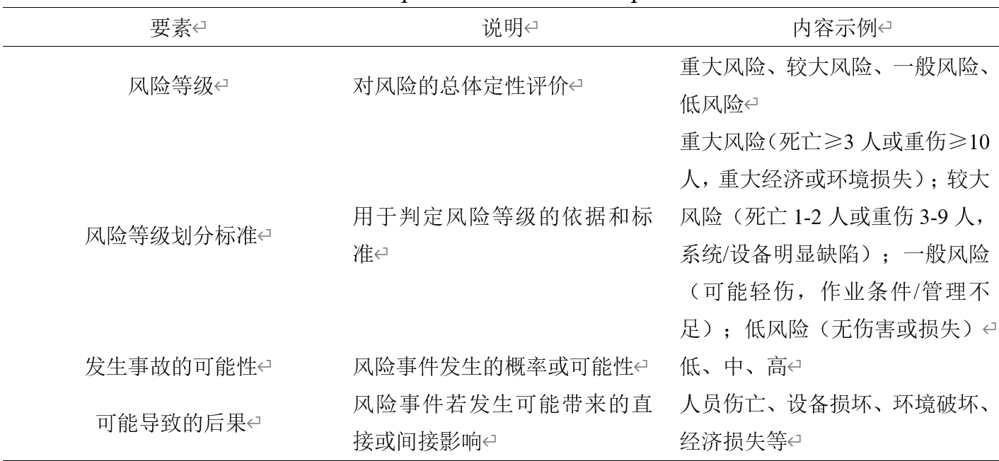
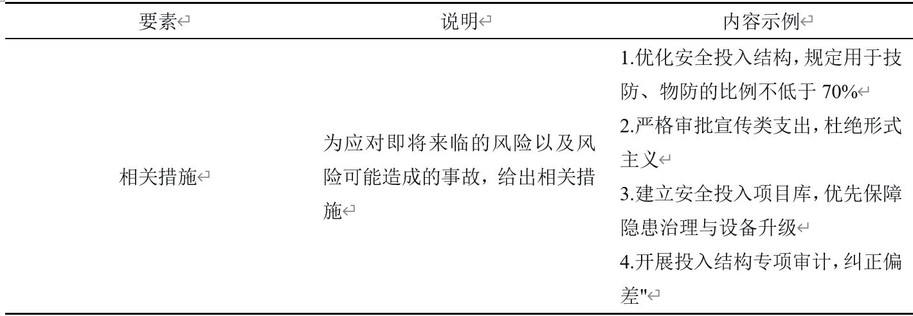
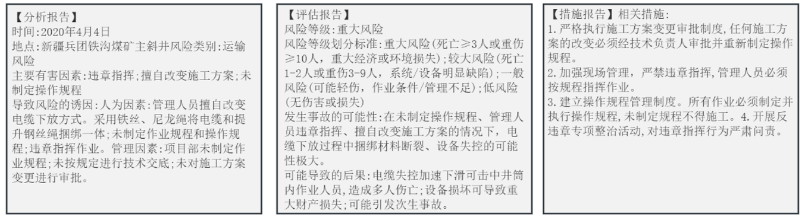

# 面向三类煤矿安全风险报告生成任务的大模型微调手册
## 一、概述
​	本案例面向煤矿安全工程、知识工程、人工智能等相关专业本科及研究生，结合煤矿安全生产实际需求，以“大模型生成符合行业规范的煤矿风险报告”为核心任务，引入**LoRA（低秩适应）**参数高效微调技术，解决通用大模型在煤矿安全领域术语不精准、报告格式不规范、风险识别不全面等问题。通过本案例的学习与实操，学生能够掌握LoRA微调的核心原理、操作流程，理解大模型在煤矿安全垂直领域的适配方法，提升AI技术与煤矿安全业务融合的实践能力，同时熟悉煤矿风险报告的编制规范与行业法规要求。

## 二、学习目标

通过学习并实际操作本案例，读者能够很好地理解什么是大模型的微调以及如何正确的使用该技术泛化其他领域的微调工作，熟练掌握各种微调框架（Transformers、PEFT等）的使用。

## 三、核心技术原理

### 3.1 LoRA微调

**LoRA（Low-Rank Adaptation，低秩适应）**是一种参数高效微调技术，其核心思想为冻结通用大模型（基座模型）的全部原始权重，不进行任何修改；在模型的关键层（如Transformer注意力机制的Q、K、V投影层）插入额外的低秩矩阵（A和B），仅训练这两个低秩矩阵的参数，通过学习领域特定知识，实现对模型输出的精准调整。

其本质是用少量可训练参数（低秩矩阵）近似全参数微调的效果，数学表达为$ΔW=AB$（其中$A∈R^{d×r}，B∈R^{r×k}，r≪d、k$），推理时将增量权重$ΔW$与原始权重$W$叠加，得到实际用于计算的权重$W_{new}=W+ΔW$。这种方式可使参数量减少100倍乃至10000倍，大幅降低显存占用与计算成本，同时保留基座模型的通用能力，实现“轻量级适配、高精度输出”。

### 3.2 三类煤矿风险报告要素

​	煤矿风险报告分为**风险分析报告**、**风险评估报告**和**风险措施报告**。针对这三类目标报告，系统开展要素抽取，提炼核心组成要素并进行精简规范。

​	**风险分析报告**面向现场巡检及基层安全管理人员，核心用于风险隐患基础摸排与定性梳理，明确时间、地点、风险类别（含瓦斯、水害、顶板等）、主要有害因素及风险诱因五大核心要素。

​	**风险评估报告**面向煤矿技术管理人员及专职安全管控部门，侧重专业性、规范性与严谨性，为风险分级管控提供核心依据，核心要素包括风险等级、等级划分标准、事故发生可能性及潜在后果。

​	**风险措施报告**面向一线作业人员、运维班组及整改执行部门，突出实操性、针对性与合规性，核心要素为具体防控整改措施。

​	三类报告示例如下图所示：

## 四、实验

​	本实验包括从环境搭建到模型训练以及模型评估的模型微调的全流程。下面开始细致讲解各个部分的具体操作。所有的实验代码均可在[Github](https://github.com/lizongyu1293306035/LoRA-Study-Case.git)上查看。

### 1.1 Python解释器及其环境安装

​	本实验依托[AutoDL](https://www.autodl.com/)平台完成实验，以此为例，读者可以按照自己的环境需求在自己的环境进行实验。同时，本实验将Qwen2.5-7B作为基座模型进行模型的LoRA微调，需要使用到显卡环境，本实验推荐硬件环境配置如下所示。

| 软、硬件名称 |      配置要求       |
| :----------: | :-----------------: |
|   显卡内存   |      不小于 GB      |
| Python解释器 |        3.10         |
|   基座模型   | Qwen2.5-7B-Instruct |

### 1.2 训练和评估数据的准备

### 1.3 LLMs参数文件下载

## 二、代码讲解及实验

### 2.1 训练代码讲解及其实验结果

### 2.2 评估代码讲解及其实验结果

### 2.3 模型效果展示

 

